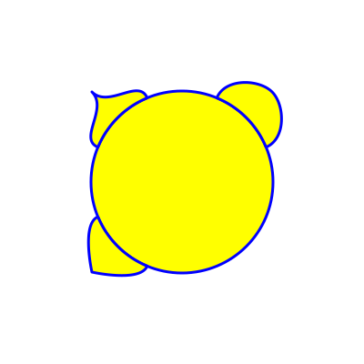
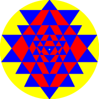

# rust-svg
This Rust crate facilitates generation of svg art.

## Supported art forms (more art forms coming soon..)
- Basic shapes
  - circle, polygon, star shapes etc.
- Leaves
  - reniform, and coordate style leaves
  
- Yantras
  - yantras like [Shri Yantra](https://en.wikipedia.org/wiki/Sri_Yantra)
  
